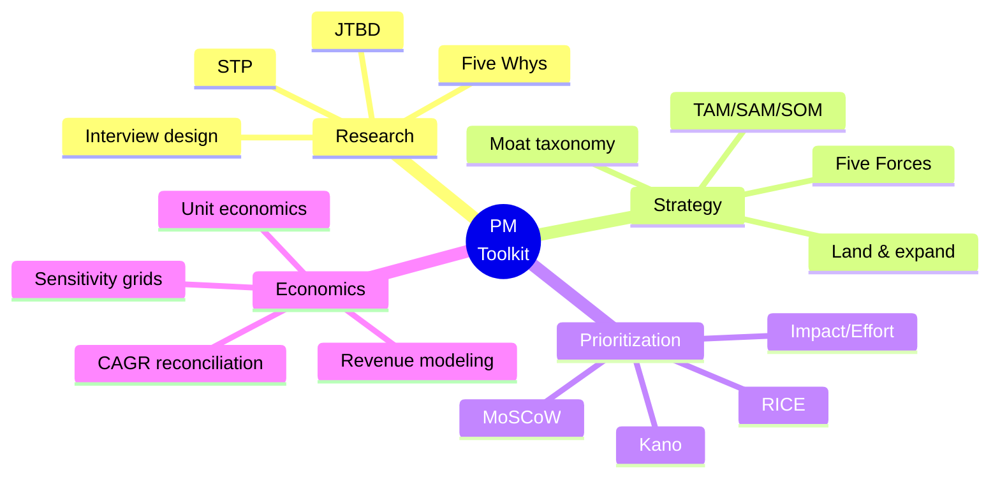

<!-- ═══════════════ HEADER ═══════════════ -->

---

## 🧭 What This Repo Is

> **7 product management case studies** built during my **AI-First Product Management** cohort (Airtribe) and independent practice — covering **mobility, quick commerce, e-commerce UX, and B2B SaaS**. Each case applies named PM frameworks to a real product problem and ships as a **PDF report + presentation deck + Excel decision workbook with live formulas** — decisions are calculated, not asserted.

**Non-fabrication standard:** no invented user quotes or usability data. Interview slots ship as real templates; any synthetic dataset is explicitly declared as such.

---

## 📁 The 7 Case Studies

🚕 <b>01 — Uber: Pickup Coordination in Dense Areas</b>

 

**Problem:** Should Uber proactively guide riders to better pickup points in crowded locations?

| Component | What's Inside |
|---|---|
| 📊 Market Research | Segment demand analysis, market sizing, alternatives, regulation & trends |
| ⚔️ Competitive Analysis | Porter's Five Forces on ride-hailing pickup experience |
| 🎤 Interview Toolkit | Full 10-interview field kit — research goal, question set, consent capture, insight template |
| 📈 Decision Workbook | 8 sheets · 72 live formulas · COUNTIFS/SUMIFS pivot cross-tabs · 3 charts |
| 🎞️ Deck | 11-slide zero-white-space presentation |

**Frameworks:** Five Forces · TAM/SAM/SOM · Segmentation · Interview design

🤖 <b>02 — B2B SaaS: AI Chatbot → AI Customer Operations Platform</b>

 

**Problem:** Evolve an AI support chatbot into a full platform — against Intercom AI, Zendesk AI, Freshdesk, Salesforce Service Cloud.

| Component | What's Inside |
|---|---|
| 🎯 Strategy | 6 steps: segment → market opportunity → core problem → moats → land-and-expand → roadmap |
| 💰 Unit Economics | CFO ROI model (**8.4x**) with 36-cell sensitivity grid |
| 📈 Justification Workbook | 11 sheets · 211 formulas · 7 native charts · CAGR reconciliation · 3-yr revenue model |
| ⚔️ Competitor Pricing | Effective-cost-per-real-resolution model |
| 🎞️ Deck | 10-slide strategy deck (strategy-on-a-page format) |

**Frameworks:** STP · Moat taxonomy · Land-and-expand · Sensitivity analysis · Hypothesis tracking

🛍️ <b>03 — Nykaa: UX Exploration & Product Decision Model</b>

 

**Problem:** Goal-driven UX audit of the Nykaa app — where does the experience break, and what should be fixed first?

| Component | What's Inside |
|---|---|
| 🔍 UX Audit | Smooth/confusing/slow/frustrating moment mapping with Severity×Frequency matrix |
| 🧮 Prioritization | RICE scoring + 50-session usability study design + SUS calculator |
| 📈 Decision Model | 50-product ValueIndex workbook (251 formulas) — Best/Improve/Worst classification, B2B/B2C split *(declared synthetic demo dataset)* |
| 🎞️ Deliverables | Master Edition PDF with embedded workbook + walkthrough deck |

**Frameworks:** Severity×Frequency · RICE · SUS · Heuristic evaluation

🛒 <b>04 — Zepto: Driving Higher Basket Size / AOV</b>

 

**Problem:** As a Zepto PM, how do you grow average order value without breaking the 10-minute promise?

| Component | What's Inside |
|---|---|
| 👥 User Research | Segmentation of quick-commerce buyers + real-insight interview structure |
| 🚧 Problem Framing | Basket-size blockers via Five Whys & first-principles decomposition |
| 💡 Solutions | 2–3 solution concepts with deep reasoning |
| 🧮 Prioritization | RICE scoring backed by Excel calculations |

**Frameworks:** JTBD · Five Whys · Double Diamond · RICE · Kano

📦 <b>05 — The 2,000 SKU Problem: Dark-Store Assortment</b>

 

**Problem:** A quick-commerce dark store holds ~2,000 SKUs. Which ones — and who decides when the shelf is full?

| Component | What's Inside |
|---|---|
| 🏗️ Capacity Framing | Constraint-first problem definition |
| 🔠 Segmentation | ABC×XYZ matrix + basket-role classification |
| ⏱️ Replenishment | Replenishment-clock design |
| 📏 Measurement | Availability measurement system (baselines declared as open slots — desk study) |

**Frameworks:** ABC/XYZ analysis · Basket-role taxonomy · Constraint thinking

⚡ <b>06 — Blinkit: Strategy & 5–10 Year Roadmap</b>

 

**Problem:** Where should Blinkit play, and how does data convert into a decade-long execution roadmap?

| Component | What's Inside |
|---|---|
| 🎯 Strategy Review | Delivery-partner misconduct/theft controls, affordability for the value segment, premium add-on pricing ownership |
| 🗺️ Roadmap | 5/10-year data-to-implementation plan (vision → mission → structure → roadmap) |
| 🎞️ Deck | 3-slide deep-dive: top-3 problems + phased roadmap with market research |

**Frameworks:** Vision-mission cascading · Phased roadmapping · Problem prioritization

🎯 <b>07 — Grocery Delivery: From 12 Interview Questions to One Target Segment</b>

 

**Problem:** A segmentation sprint — turn raw user-research questions into a defensible target-segment choice.

| Component | What's Inside |
|---|---|
| 🎤 Research Design | 12-question interview instrument |
| 👥 Segmentation | 4 segment cards built from research signals |
| ⚖️ Selection | 5-filter scorecard → **"Schedule Selector"** chosen as target segment |
| ✍️ Essays | Published as the *PM Strategy Series*: "Metrics Tell You What. Users Tell You Why." |

**Frameworks:** STP · Segment scorecards · Qual-to-decision synthesis

---

## 🧰 Framework Toolbox Used Across Cases

---

## 📦 Deliverable Standard (Every Case)

| Deliverable | Format | Rule |
|---|---|---|
| 📄 **Case Report** | PDF | Zero white space — pages filled edge to edge |
| 🎞️ **Presentation Deck** | PPTX + PDF | Programmatically validated: no overflow, no overlaps |
| 📈 **Decision Workbook** | XLSX + PDF | Live formulas, Excel Tables, pivots — every number traceable |
| 🛡️ **Integrity Statement** | Inline | AI role disclosed · no fabricated user data · synthetic data declared |

---

## 👤 Author

**Eswar Mahalingam** · MBA · CSCMP SCPro · Six Sigma Black Belt
Data Analyst · AI-First Product Management (Airtribe) · Ghaziabad, India

