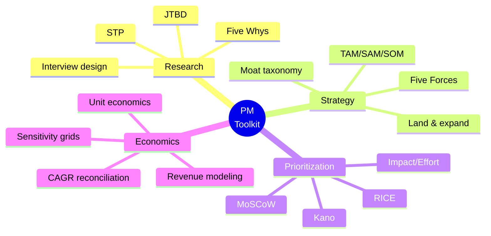

<!-- ═══════════════ CAREER CONTROL TOWER · REPOSITORY · PM ═══════════════ -->

    

   

**AI-First Product Management cohort (Airtribe, 2026) + independent practice** · research · strategy · PRDs · metrics · PLG · system design — every decision calculated in a live-formula workbook, never asserted

> 📘 **[Download the project book (PDF)](PM_Case_Book.pdf)** — cover + one summary sheet per project (12 sheets): what it is, verified results, deliverables, method, role fit and how to verify. Individual sheets: [`case-sheets/`](case-sheets/).

## 🧭 What This Repo Is

> **12 product management case studies** built during my **AI-First Product Management** cohort (Airtribe) and independent practice — covering **mobility, quick commerce, e-commerce UX, B2B SaaS, fitness, food delivery, travel PLG and platform system design**. Each case applies named PM frameworks to a real product problem and ships as a **PDF report + presentation deck + Excel decision workbook with live formulas** — decisions are calculated, not asserted.

**Non-fabrication standard:** no invented user quotes or usability data. Interview slots ship as real templates; any synthetic dataset is explicitly declared as such.

## 📁 The 12 Case Studies

🚕 <b>01 — Uber: Pickup Coordination in Dense Areas</b>

 

**Problem:** Should Uber proactively guide riders to better pickup points in crowded locations?

| Component | What's Inside |
|---|---|
| 📊 Market Research | Segment demand analysis, market sizing, alternatives, regulation & trends |
| ⚔️ Competitive Analysis | Porter's Five Forces on ride-hailing pickup experience |
| 🎤 Interview Toolkit | Full 10-interview field kit — research goal, question set, consent capture, insight template |
| 📈 Decision Workbook | 8 sheets · 72 live formulas · COUNTIFS/SUMIFS pivot cross-tabs · 3 charts |
| 🎞️ Deck | 11-slide zero-white-space presentation |

**Frameworks:** Five Forces · TAM/SAM/SOM · Segmentation · Interview design

🤖 <b>02 — B2B SaaS: AI Chatbot → AI Customer Operations Platform</b>

 

**Problem:** Evolve an AI support chatbot into a full platform — against Intercom AI, Zendesk AI, Freshdesk, Salesforce Service Cloud.

| Component | What's Inside |
|---|---|
| 🎯 Strategy | 6 steps: segment → market opportunity → core problem → moats → land-and-expand → roadmap |
| 💰 Unit Economics | CFO ROI model (**8.4x**) with 36-cell sensitivity grid |
| 📈 Justification Workbook | 11 sheets · 211 formulas · 7 native charts · CAGR reconciliation · 3-yr revenue model |
| ⚔️ Competitor Pricing | Effective-cost-per-real-resolution model |
| 🎞️ Deck | 10-slide strategy deck (strategy-on-a-page format) |

**Frameworks:** STP · Moat taxonomy · Land-and-expand · Sensitivity analysis · Hypothesis tracking

🛍️ <b>03 — Nykaa: UX Exploration & Product Decision Model</b>

 

**Problem:** Goal-driven UX audit of the Nykaa app — where does the experience break, and what should be fixed first?

| Component | What's Inside |
|---|---|
| 🔍 UX Audit | Smooth/confusing/slow/frustrating moment mapping with Severity×Frequency matrix |
| 🧮 Prioritization | RICE scoring + 50-session usability study design + SUS calculator |
| 📈 Decision Model | 50-product ValueIndex workbook (251 formulas) — Best/Improve/Worst classification, B2B/B2C split *(declared synthetic demo dataset)* |
| 🎞️ Deliverables | Master Edition PDF with embedded workbook + walkthrough deck |

**Frameworks:** Severity×Frequency · RICE · SUS · Heuristic evaluation

🛒 <b>04 — Zepto: Driving Higher Basket Size / AOV</b>

 

**Problem:** As a Zepto PM, how do you grow average order value without breaking the 10-minute promise?

| Component | What's Inside |
|---|---|
| 👥 User Research | Segmentation of quick-commerce buyers + real-insight interview structure |
| 🚧 Problem Framing | Basket-size blockers via Five Whys & first-principles decomposition |
| 💡 Solutions | 2–3 solution concepts with deep reasoning |
| 🧮 Prioritization | RICE scoring backed by Excel calculations |

**Frameworks:** JTBD · Five Whys · Double Diamond · RICE · Kano

📦 <b>05 — The 2,000 SKU Problem: Dark-Store Assortment</b>

 

**Problem:** A quick-commerce dark store holds ~2,000 SKUs. Which ones — and who decides when the shelf is full?

| Component | What's Inside |
|---|---|
| 🏗️ Capacity Framing | Constraint-first problem definition |
| 🔠 Segmentation | ABC×XYZ matrix + basket-role classification |
| ⏱️ Replenishment | Replenishment-clock design |
| 📏 Measurement | Availability measurement system (baselines declared as open slots — desk study) |

**Frameworks:** ABC/XYZ analysis · Basket-role taxonomy · Constraint thinking

⚡ <b>06 — Blinkit: Strategy & 5–10 Year Roadmap</b>

 

**Problem:** Where should Blinkit play, and how does data convert into a decade-long execution roadmap?

| Component | What's Inside |
|---|---|
| 🎯 Strategy Review | Delivery-partner misconduct/theft controls, affordability for the value segment, premium add-on pricing ownership |
| 🗺️ Roadmap | 5/10-year data-to-implementation plan (vision → mission → structure → roadmap) |
| 🎞️ Deck | 3-slide deep-dive: top-3 problems + phased roadmap with market research |

**Frameworks:** Vision-mission cascading · Phased roadmapping · Problem prioritization

🎯 <b>07 — Grocery Delivery: From 12 Interview Questions to One Target Segment</b>

 

**Problem:** A segmentation sprint — turn raw user-research questions into a defensible target-segment choice.

| Component | What's Inside |
|---|---|
| 🎤 Research Design | 12-question interview instrument |
| 👥 Segmentation | 4 segment cards built from research signals |
| ⚖️ Selection | 5-filter scorecard → **"Schedule Selector"** chosen as target segment |
| ✍️ Essays | Published as the *PM Strategy Series*: "Metrics Tell You What. Users Tell You Why." |

**Frameworks:** STP · Segment scorecards · Qual-to-decision synthesis

🏋️ <b>08 — VitaFit: PRD for Engagement & Retention Features</b>

 

**Problem:** Users of an on-demand fitness platform lose motivation and feel no connection with instructors — design two features that lift repeat usage.

| Component | What's Inside |
|---|---|
| 📄 PRD (8 pp) | Personas Drifter · Duo · Loyalist · 6 options + RICE · **F1 Squads & Streak Challenges** · **F2 Instructor Circles & Coach Notes** · NF-1–NF-10 · 8 edge cases |
| 📈 Metrics | North Star = weekly active exercisers · **+15 % relative W4 retention** target via 50/50 8-week holdout · kill criteria per rollout stage |
| 🗺️ Core flows | 6 flowcharts · 18 vector wireframes · streak & Coach-Note state models · 18-event analytics schema |
| 📊 Workbook | 13 sheets · **1,503 live formulas** · declared-synthetic 120-member squad simulation |
| 🔬 Research annex | 12-source register (Strava, Peloton, Duolingo, peer-reviewed studies) · 4 FigJam flow boards |

**Frameworks:** PRD anatomy · RICE · metric tree · staged rollout with kill criteria

🍽️ <b>09 — Zomato: Funnel, Cohorts & North Star (Tier-1 cities)</b>

 

**Problem:** Improve engagement and retention across Discovery → Order → Delivery.

| Component | What's Inside |
|---|---|
| 🔻 Funnel | 7 stages, one hypothesis each · declared-synthetic weekly funnel **17.6 % → 26.4 %** delivered target · priority: cart→checkout and checkout→placed |
| 👥 Cohorts | New vs repeat · high vs low frequency · discount vs full-price — retention challenge + hypothesis per cohort |
| ⭐ North Star | On-promise delivered orders per monthly transacting customer (3.1 → 3.6) · 13 solutions each with input / output / leading / lagging / guardrail metrics · 4 KRs |
| 💰 Unit economics | CAC ₹320 · contribution ₹36.8 / order · break-even 8.7 orders |
| 📊 Workbook | 12 sheets · 163 live formulas · 0 errors |

**Frameworks:** AARRR · North Star · metric ladders · OKRs · funnel & cohort analysis

🏡 <b>10 — Airbnb India: PLG Loops, MVPs & Revenue Model</b>

 

**Problem:** Design product-led growth for Airbnb India after product-market fit — enablers, loops, MVPs and a monetisation model.

| Component | What's Inside |
|---|---|
| 🔁 PLG | Expansion grid · cohort PMF scorecard · persona "Arjun the Group Planner" · enablers E1–E6 · loops L1–L6 · India flywheel · RICE roadmap |
| 🧪 MVPs | Shared experiment contract + 4 MVPs — Trip Split · Host-in-15 + Guest→Host · Trip Recap + multilingual guides · Coins + long-weekend planner |
| 💰 Revenue | Five-layer model R1–R5 (fees, Host Pro, Yatra Pass, sponsorship, partners/B2B) · FY29 scenario declared synthetic · assumption register + pre-mortem |
| 📊 Workbook | 11 sheets · 177 live formulas · 0 errors · 10-slide deck · 42-pp master |

**Frameworks:** PLG loops & flywheels · MVP / experiment design · RICE · revenue modelling

🛵 <b>11 — QuickBite: National-Rollout System Design Brief</b>

 

**Problem:** As PM, take a food-delivery app from 5,000 users / ~40 restaurants to 2 M users in 12 months — what must the system become?

| Component | What's Inside |
|---|---|
| 🧱 Design brief | Requirements · data model · architecture · request flow · statefulness · performance vs consistency · incident drill · executive summary (2,499 words) |
| 📐 Traffic model | ~40k orders/day, ~1.5 orders/s peak — status polls, tracking and rider pings dominate load |
| 📊 Workbook | 12 sheets · 280 live formulas · NFR targets · component register · 10-slide deck · 34-pp master |

**Frameworks:** client-server · APIs & status codes · databases & caching · NFRs · incident response

🎓 <b>12 — SkillBridge "Compass": Personalised Learning Recommendation System</b>

 

**Problem:** Lift engagement (+25 %), completion (+30 %) and satisfaction (+20 %) on an online-education platform for learners, instructors and admins.

| Component | What's Inside |
|---|---|
| 📝 Requirements | User stories · functional-requirements table · NFRs in 7 categories |
| 🧠 System design | Core architecture + diagram · **trade-off: hybrid batch top-50 + real-time re-rank + event-triggered recompute** · assumptions & future scope |
| 📊 Workbook | 12 sheets · 159 live formulas · 10-slide deck · 62-pp master |

**Frameworks:** user stories · FR/NFR design · recommender architecture · trade-off analysis

## 🧰 Framework Toolbox Used Across Cases

```mermaid
mindmap
  root((PM<br/>Toolkit))
    Research
      JTBD
      STP
      Interview design
      Five Whys
    Strategy
      Five Forces
      TAM/SAM/SOM
      Moat taxonomy
      Land & expand
    Prioritization
      RICE
      Kano
      MoSCoW
      Impact/Effort
    Economics
      Unit economics
      Sensitivity grids
      Revenue modeling
      CAGR reconciliation
```

## 📦 Deliverable Standard (Every Case)

| Deliverable | Format | Rule |
|---|---|---|
| 📄 **Case Report** | PDF | Zero white space — pages filled edge to edge |
| 🎞️ **Presentation Deck** | PPTX + PDF | Programmatically validated: no overflow, no overlaps |
| 📈 **Decision Workbook** | XLSX + PDF | Live formulas, Excel Tables, pivots — every number traceable |
| 🛡️ **Integrity Statement** | Inline | AI role disclosed · no fabricated user data · synthetic data declared |

**Eswar Mahalingam** · B.Com · MBA · PGDLSCM · CSCMP SCPro · Six Sigma Black Belt
Data Scientist @ Zidio Development · Ghaziabad NCR, India · Open to India · EU (Blue Card) · Gulf · Immediate joiner

